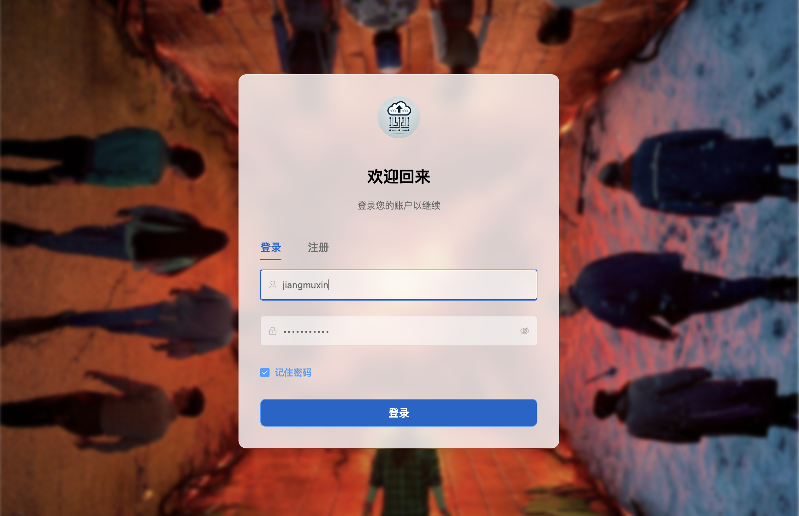
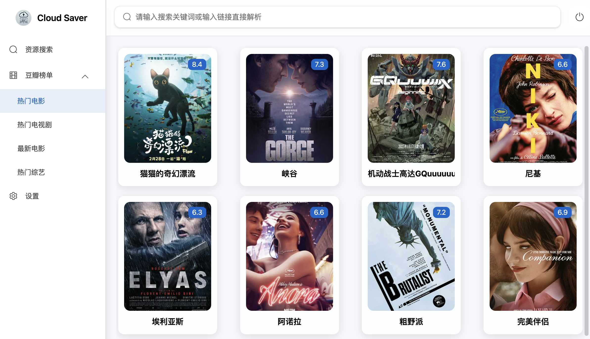
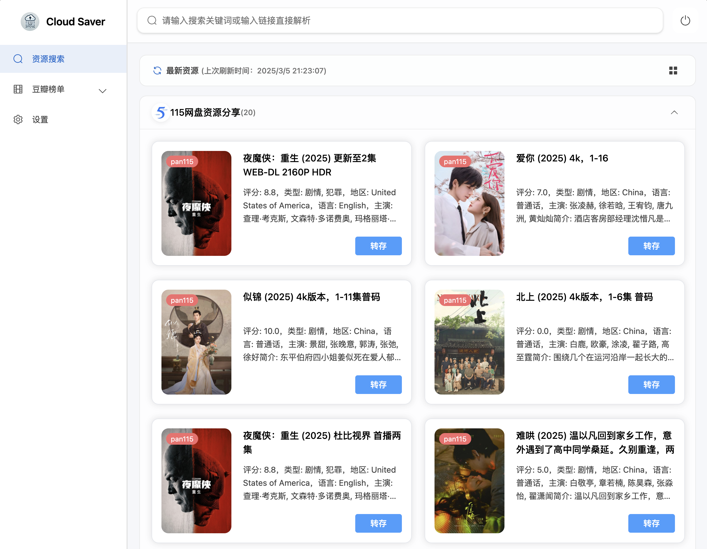
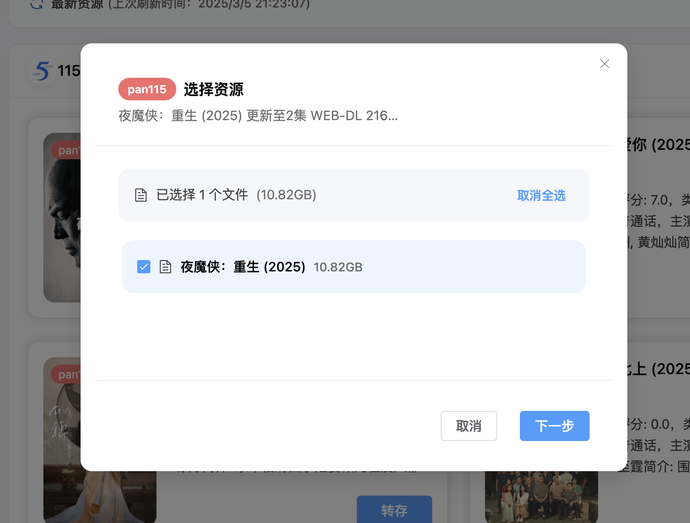
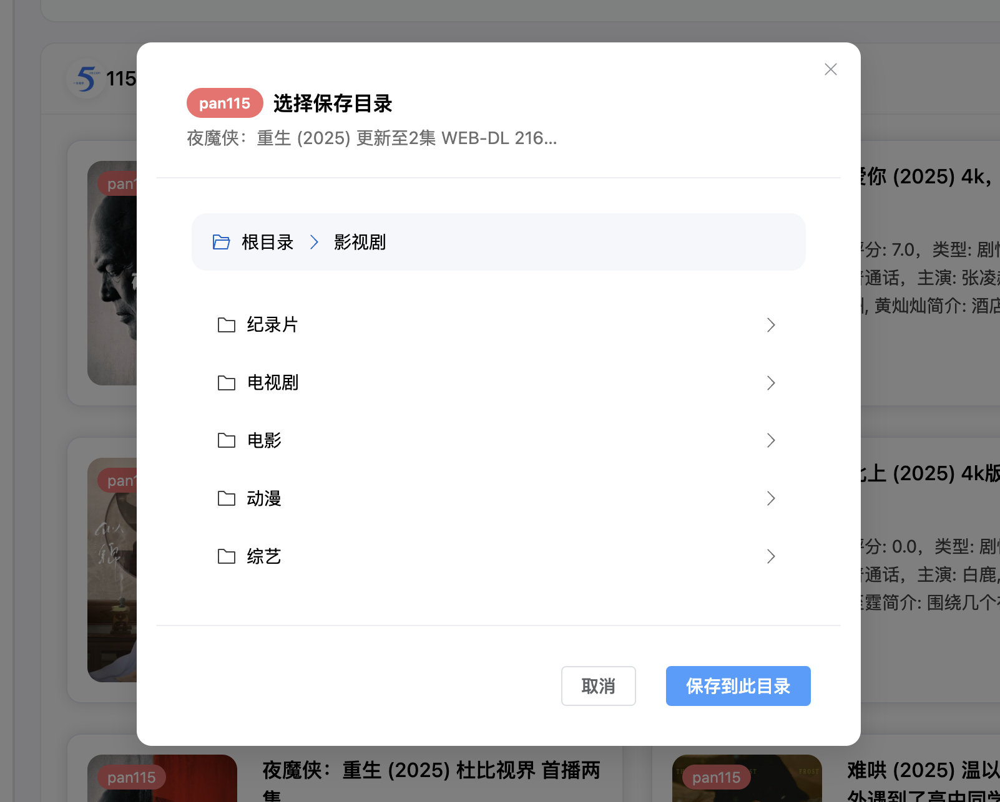
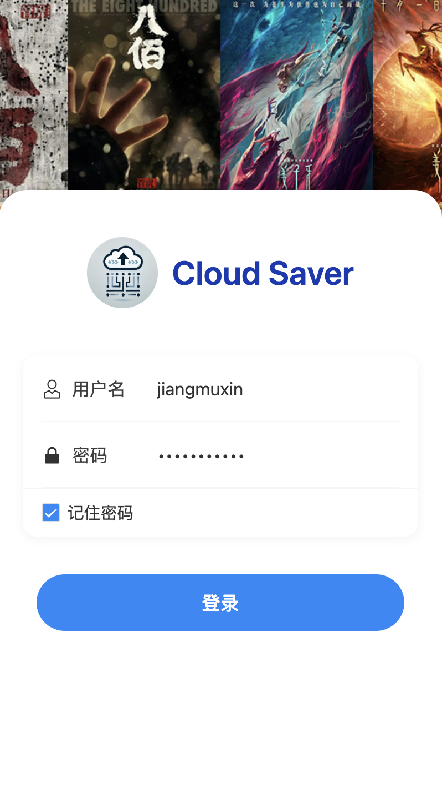
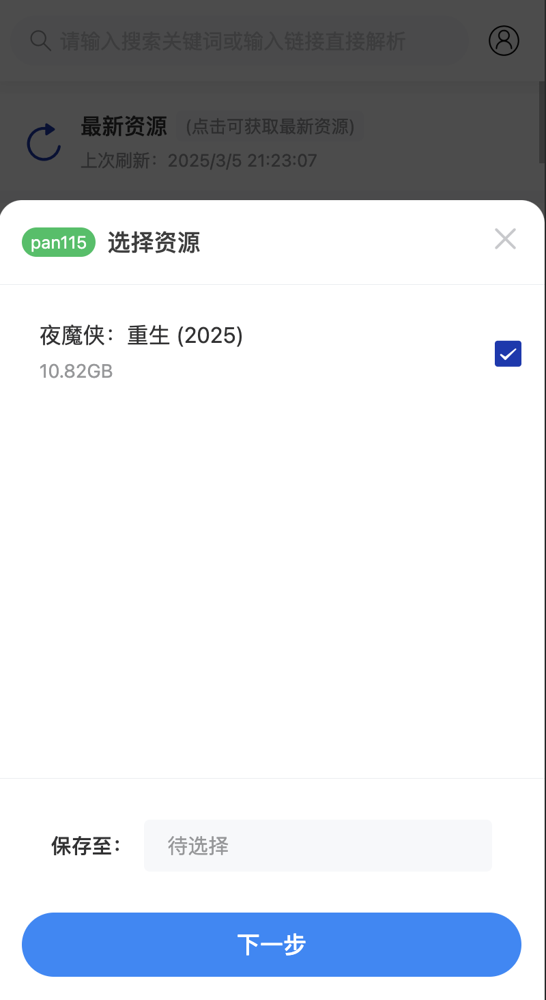
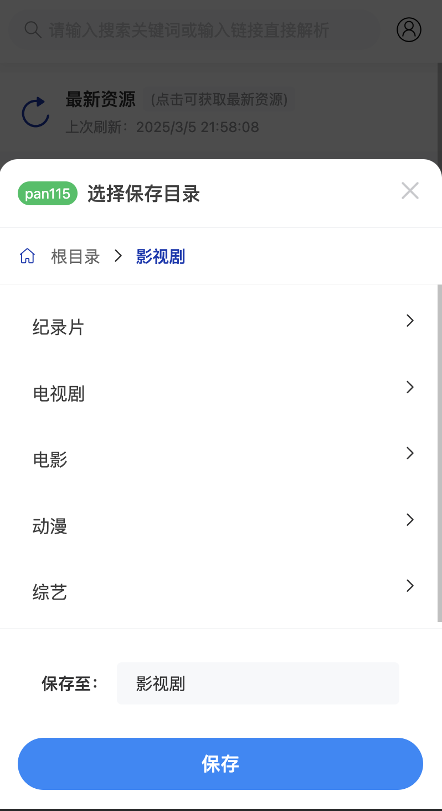
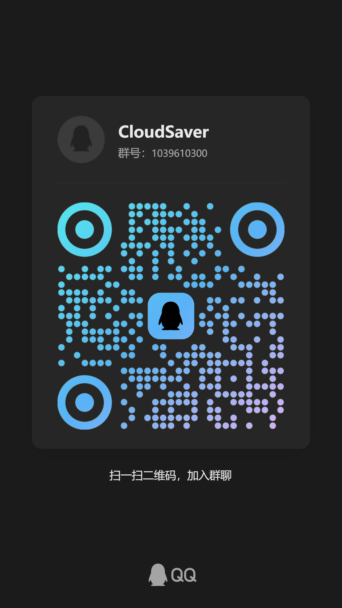

# CloudSaver


[](https://github.com/jiangrui1994/CloudSaver/stargazers)

<a href="https://hellogithub.com/repository/d13663fb959345e7923ecaccc3387571" target="_blank"></a>

一个基于 Vue 3 + Express 的网盘资源搜索与转存工具，支持响应式布局，移动端与PC完美适配，可通过 Docker 一键部署。

官方Telegram群组：[https://t.me/cloud_saver](https://t.me/cloud_saver)

官方QQ交流群（[二维码](https://github.com/jiangrui1994/CloudSaver?tab=readme-ov-file#%E8%81%94%E7%B3%BB%E6%96%B9%E5%BC%8F)）：

1039610300(满了)

389429056(满了)

版本更新日志：[https://www.yuque.com/xiaoruihenbangde/ggogn3/vxoqxkx4rkcz3g94](https://www.yuque.com/xiaoruihenbangde/ggogn3/vxoqxkx4rkcz3g94)

CloudSaver部署与使用常见问题(包含更多搜索频道)：[https://www.yuque.com/xiaoruihenbangde/ggogn3/ga6gaaiy5fsyw62l](https://www.yuque.com/xiaoruihenbangde/ggogn3/ga6gaaiy5fsyw62l)
密码 me16 点个Star呗~

⚠️关于项目更新与需求处理的核心声明：[https://www.yuque.com/xiaoruihenbangde/ggogn3/gt9cgqn2n3vergxx](https://www.yuque.com/xiaoruihenbangde/ggogn3/gt9cgqn2n3vergxx)

---

⚠️**由于某些原因，[新版本](https://www.yuque.com/xiaoruihenbangde/ggogn3/vxoqxkx4rkcz3g94)内容不包含在此开源仓库(停留在V0.2.5版本)，如需使用，请使用docker镜像进行部署使用。**

---

**🔒 重要安全提醒｜关于本项目私有化部署的强制建议**

为保障您的数据安全与隐私权益，请务必**通过Docker自行私有化部署本项目**。我们**强烈反对**使用任何第三方提供的在线网站或他人部署的服务，原因如下：

⚠️ **高风险预警**

- 本项目涉及**网盘Cookie等敏感凭据**，若使用他人服务：  
  ▶ 您的账号密码、隐私文件可能遭恶意窃取或篡改  
  ▶ 攻击者可利用Cookie直接登录您的网盘实施破坏  
  ▶ 数据泄露、资产损失等后果需完全由使用者自行承担

🚫 **严正声明**

1. 本项目**从未且不会**提供任何形式的在线服务、公开Demo或托管平台
2. **任何声称与本项目相关的在线网站均为未授权第三方搭建**，存在蓄意作恶的高风险
3. 如因使用非自建服务导致损失，本项目开发者**不承担任何法律责任**

❓ **常见问题**  
Q: 是否有在线Demo可直接试用？  
A: **绝无可能！** 任何在线服务都与本项目无关，请立即关闭避免信息泄露

Q: 为何不能使用他人部署好的服务？  
A: Cookie等同于账号密码，交出Cookie=交出家门钥匙，请勿将身家安全托付陌生人

Q: 如何确保100%安全？  
A: 唯一可信方案：通过官方仓库代码+自主服务器部署，全程数据闭环

---

**🛡️ 最后一次严肃提醒**  
您的账号安全只应掌握在自己手中！  
请立即执行私有化部署 ▶ 避免无法挽回的数据灾难

---

## 功能特性

- 🔍 多源资源搜索
  - 支持多个资源订阅源搜索
  - 支持关键词搜索与资源链接解析
  - 支持豆瓣热门榜单展示
- 💾 网盘资源转存
  - 支持**115 网盘，夸克网盘，天翼网盘，123云盘**一键转存
  - 支持转存文件夹展示与选择
- 👥 多用户系统
  - 支持用户注册登录
  - 支持管理员与普通用户权限区分
- 📱 响应式设计
  - 支持 PC 端与移动端自适应布局
  - 针对不同设备优化的交互体验

## 产品展示

### PC 端

<div align="center">
  
   
  <p>登录页面/榜单</p>
</div>

<div align="center">
  
  
  <p>资源搜索/资源详情</p>
</div>

<div align="center">
  
  
  <p>资源转存</p>
</div>

### 移动端

<div align="center">
  <div style="display: inline-block; margin: 0 20px;">
    
    
    
    
  </div>
</div>

## 技术栈

### 前端

- 核心框架
  - Vue 3
  - TypeScript
  - Vite
- 状态管理
  - Pinia
- 路由管理
  - Vue Router
- UI 组件库
  - Element Plus (PC)
  - Vant (Mobile)
- 工具库
  - Axios

### 后端

- 运行环境
  - Node.js
  - Express
- 数据存储
  - SQLite3

## 环境要求

- Node.js >= 18.x
- pnpm >= 8.x (推荐)

## 快速开始

### 开发环境

1. 克隆项目

```bash
git clone https://github.com/jiangrui1994/CloudSaver.git
cd CloudSaver
```

2. 安装依赖

```bash
pnpm install
```

3. 配置环境变量

```bash
cp ./backend/.env.example ./backend/.env
```

根据 `.env.example` 文件说明配置必要的环境变量。

4. 启动开发服务器

```bash
pnpm dev
```

### 生产环境部署

1. 构建前端

```bash
pnpm build:frontend
```

2. 构建后端

```bash
cd backend
pnpm build
```

3. 启动服务

```bash
pnpm start
```

### Docker 部署

说明：镜像源有**两个地址**供选择，下面部署命令中使用的是dockerhub托管的地址为例，github托管的地址请自行替换

- dockerhub托管：
  - `jiangrui1994/cloudsaver:latest` 稳定版
  - `jiangrui1994/cloudsaver:test` 测试版 （包含最新功能和bug修复，但可能不如稳定版稳定）
- github托管：
  - `ghcr.io/jiangrui1994/cloudsaver:latest` 稳定版
  - `ghcr.io/jiangrui1994/cloudsaver:test` 测试版 （包含最新功能和bug修复，但可能不如稳定版稳定）

#### 单容器部署

稳定版：

```bash
docker run -d \
  -p 8008:8008 \
  -v /your/local/path/data:/app/data \
  -v /your/local/path/config:/app/config \
  --name cloud-saver \
  jiangrui1994/cloudsaver:latest
```

测试版（包含最新功能和bug修复，但可能不如稳定版稳定）：

```bash
docker run -d \
  -p 8008:8008 \
  -v /your/local/path/data:/app/data \
  -v /your/local/path/config:/app/config \
  --name cloud-saver \
  jiangrui1994/cloudsaver:test
```

#### Docker Compose 部署

创建 `docker-compose.yml` 文件：

稳定版：

```yaml
version: "3"
services:
  cloudsaver:
    image: jiangrui1994/cloudsaver:latest
    container_name: cloud-saver
    ports:
      - "8008:8008"
    volumes:
      - /your/local/path/data:/app/data
      - /your/local/path/config:/app/config
    restart: unless-stopped
```

测试版：

```yaml
version: "3"
services:
  cloudsaver:
    image: jiangrui1994/cloudsaver:test
    container_name: cloud-saver
    ports:
      - "8008:8008"
    volumes:
      - /your/local/path/data:/app/data
      - /your/local/path/config:/app/config
    restart: unless-stopped
```

#### /app/config 目录说明

- `env` 文件：包含后端环境变量配置

```bash
# JWT配置
JWT_SECRET=your_jwt_secret_here

# Telegram配置
TELEGRAM_BASE_URL=https://t.me/s

# Telegram频道配置(0.3.0及之后版本无效)
TELE_CHANNELS=[{"id":"xxxx","name":"xxxx资源分享"}]
```

运行：

```bash
docker-compose up -d
```

> **注意**: 测试版（:test标签）包含最新的功能开发和bug修复，但可能存在不稳定因素。建议生产环境使用稳定版（:latest标签）。

## 注意事项

1. 资源搜索需要配置代理环境
2. 默认注册码
   - 管理员：230713
   - 普通用户：9527

## 联系方式

<div align="center">
  <div>
    
    <p>qq交流群(2群)(满了！！！)</p>
  </div>
</div>

## 支持项目

如果您觉得这个项目对您有帮助，可以考虑给予一点支持，这将帮助我们持续改进项目 ❤️

您可以：

- ⭐ 给项目点个 Star
- 🎉 分享给更多有需要的朋友
- ☕ 请作者喝杯冰阔乐或咖啡
- 💰 **赞赏了一定记得和我联系**

<div align="center">
  <div style="display: inline-block; margin: 0 20px;">
    
    
  </div>
</div>

## 特别声明

1. 本项目仅供学习交流使用，请勿用于非法用途
2. 仅支持个人使用，不支持任何形式的商业使用
3. 禁止在项目页面进行任何形式的广告宣传
4. 所有搜索到的资源均来自第三方，本项目不对其真实性、合法性做出任何保证

## 贡献指南

1. Fork 本仓库
2. 创建特性分支 (`git checkout -b feature/AmazingFeature`)
3. 提交更改 (`git commit -m 'Add some AmazingFeature'`)
4. 推送到分支 (`git push origin feature/AmazingFeature`)
5. 提交 Pull Request

## 开源协议

本项目基于 MIT 协议开源 - 查看 [LICENSE](LICENSE) 文件了解更多细节

## 鸣谢

- 👨‍💻 感谢所有为这个项目做出贡献的开发者们！
- 👥 感谢所有使用本项目并提供反馈的用户！
- 感谢所有给予支持和鼓励的朋友们！

## Star History

[](https://www.star-history.com/#jiangrui1994/cloudsaver&Date)
