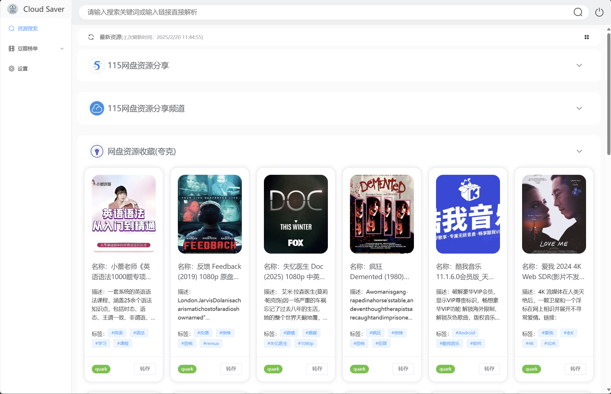
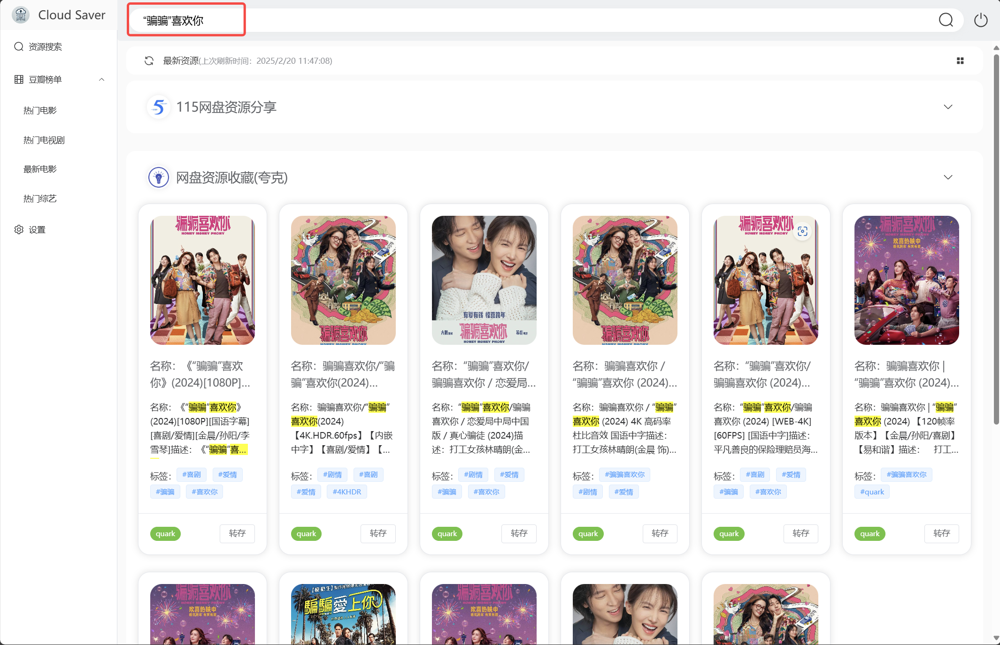
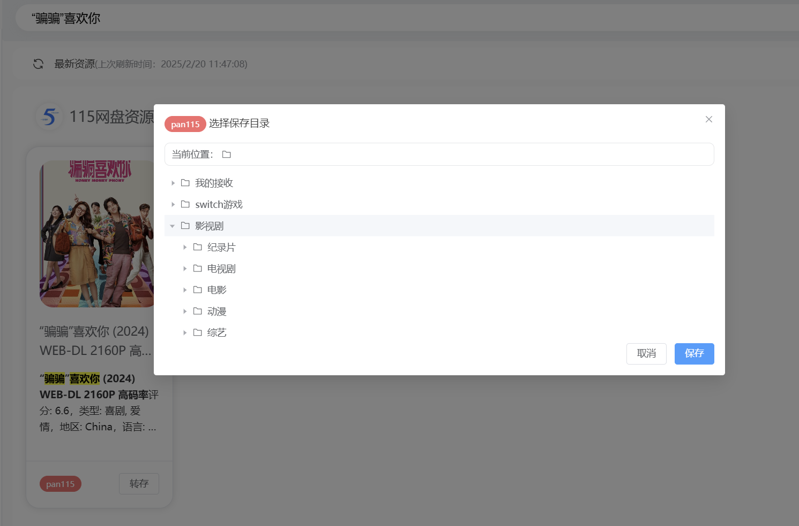
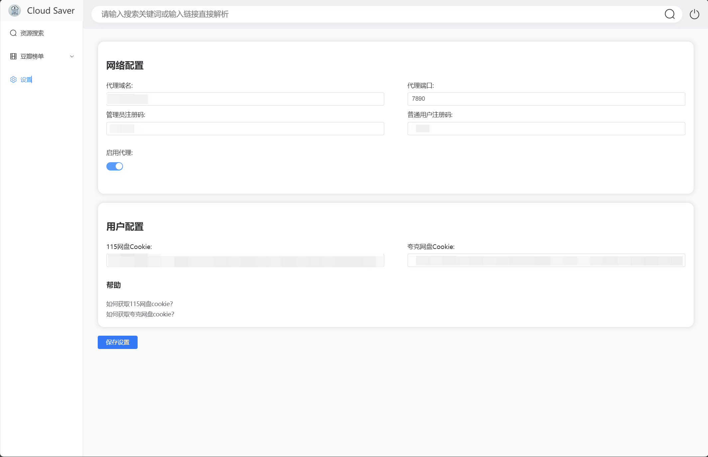

# CloudSaver

一个基于 Vue 3 + Express 的网盘资源搜索与转存工具。
可通过docker 一键部署。

## 特别声明

1. 此项目仅供学习交流使用，请勿用于非法用途。
2. 仅支持个人使用，不支持任何形式的 commercial 使用。
3. 禁止在项目页面上进行任何形式的广告宣传。
4. 所有搜索到的资源均来自第三方，本项目不对其真实性、合法性做出任何保证。

## 注意事项

1. 此项目的资源搜索需要用到代理环境，请自行搭建。
2. 新用户注册，管理员默认注册码：230713；普通用户默认注册码：9527

## 功能特性

- 支持多个资源订阅(电报群)源搜索
- 支持 115 网盘与夸克网盘**一键**资源转存
- 支持关键词搜索与资源链接解析
- 支持转存文件夹展示与选择
- 支持多用户使用
- 支持豆瓣热门榜单
- 支持热门榜单资源搜索

## 预览

### 登录/注册


### 最新资源搜索



### 关键词搜索



### 热门榜单


### 转存




### 系统设置




## 技术栈

### 前端

- Vue 3
- TypeScript
- Element Plus
- Pinia
- Vue Router
- Vite

### 后端

- Node.js
- Express
- TypeScript
- Sqlite3
- RSS Parser

## 环境配置

### Node.js 版本

本项目需要 `Node.js` 版本 `18.x` 或更高版本。请确保在运行项目之前安装了正确的版本。

推荐使用pnpm进行依赖包安装，默认支持workspace，可以避免版本冲突。

### 后端配置项

复制环境变量模板文件：

```
cp .env.example ./backend/.env
```

- 根据 `.env.example`文件在 `backend`目录下创建 `.env`文件。

## 使用

### 开发环境本地运行

- 安装依赖：`npm run install`
- 启动开发环境：`npm run dev`

### 打包部署

- 前端打包：`npm run build:frontend` 或者进入前端目录`frontend`，执行 `npm run build`
- 将前端构建产物`dist`目录下的文件复制到服务器上,例如`nginx`的`html`目录下。
- 后端服务：先进入后端目录`backend`下`npm run build`构建，然后执行 `npm run start`启动,默认端口为`8009`。
- 通过`nginx`配置代理服务,将前端api的请求映射到后端服务。

## Docker 部署

- 构建镜像：
```bash
# 构建示例
docker build --platform linux/amd64 -t cloud-saver . --no-cache
```
- 运行容器：
```bash
docker run -d -p 8008:8008 --name cloud-saver cloud-saver
```

## 交流沟通


## License

This project is licensed under the MIT License - see the [LICENSE](LICENSE) file for details.
